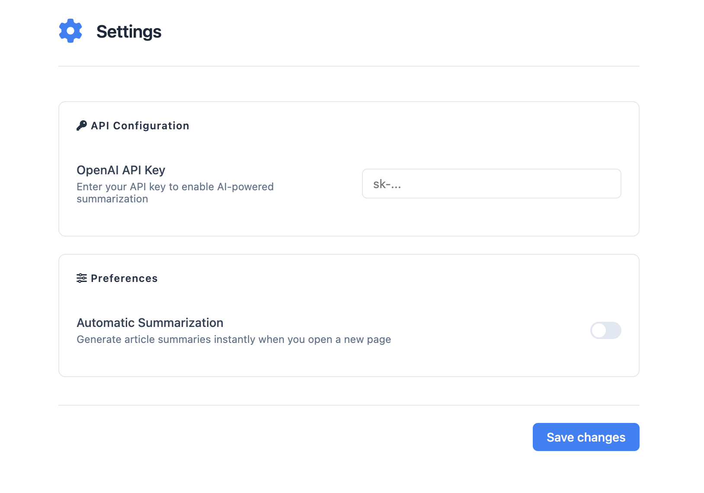

# 🪝 Offbait


> Tired of scrolling through 15 paragraphs just to find out you can actually microwave that leftover pizza? Yeah, we feel you.

In today's internet, content creators often bury the good stuff under mountains of fluff, ads, and SEO keywords. Why? Because that's how they make money. But your time is worth more than that.

This extension fights back against clickbait and content bloat. It uses AI to instantly extract what you actually want to know - the key points, the real answer, the important stuff. Whether it's a recipe buried under someone's life story or a product review hidden in affiliate links, we'll get you straight to the point.

Think of it as your personal BS filter for the internet. Not only will you save time, but maybe, just maybe, we'll help push the internet back towards what matters: quality content that respects your time.

## 🏃‍♂️ Quick Start

### Local Installation

#### Chrome
1. Clone this repository:
   ```bash
   git clone https://github.com/yourusername/page-summarizer.git
   cd page-summarizer
   ```

2. Build the extension:
   ```bash
   ./build.sh
   ```

3. Open Chrome and go to `chrome://extensions/`
4. Enable "Developer mode" in the top right
5. Click "Load unpacked" and select the `build/chrome` directory

#### Firefox
1. Clone the repository
2. Open Firefox and go to `about:debugging`
3. Click "This Firefox" in the left sidebar
4. Click "Load Temporary Add-on"
5. Select `manifest.json` in the project root

### Development
1. Make sure you have your OpenAI API key ready

2. Install the extension using the steps above
3. Open the extension settings and enter your API key
4. To see your changes:
   - Chrome: build using `./build.sh` and click the refresh button on the extension card
   - Firefox: Reload the extension from `about:debugging`

## ✨ Features

- 🤖 AI-powered summarization using OpenAI's GPT models
- 🚀 Automatic or manual summary generation for web pages
- 📱 Clean, modern UI with responsive design
- 📋 One-click sharing functionality
- 🎯 Extractive key takeaways
- ⚙️ Configurable settings with API key management
- 🔄 Loading states and error handling
- 🎨 Tailored summaries based on content type (articles, recipes, product pages, etc.)
- 🌐 Support for both Chrome and Firefox browsers

## 🛠️ Technical Implementation

### Core Components

- **Content Script**: Handles page analysis and summary injection
- **Background Script**: Manages browser action and extension lifecycle
- **Options Page**: Provides user configuration interface
- **UI Components**: Creates modern, responsive summary displays

### Key Files

- `summarizer.js`: AI integration and content processing
- `ui.js`: Summary panel and interface components
- `auto-summarize.js`: Automatic summarization logic
- `options.js`: Settings management
- `utils.js`: Helper functions and utilities

### Browser Support

- Chrome (Manifest V3)
- Firefox (Manifest V2)

## 🔧 Configuration

### API Setup

1. Open the extension settings
2. Enter your OpenAI API key
3. Configure auto-summarization preference

### Permissions Required

- `activeTab`: For accessing current page content
- `storage`: For saving user preferences
- `scripting`: For Chrome manifest V3 support
- `host_permissions`: For running on web pages

## 💡 How It Works

1. **Content Detection**
   - Analyzes current page to determine if it's suitable for summarization
   - Excludes homepages and non-article pages

2. **Summary Generation**
   - Cleanses HTML content
   - Sends processed text to OpenAI API
   - Generates concise summary and key takeaways
   - Adapts output based on content type

3. **Display**
   - Shows loading indicator during generation
   - Presents summary in a clean, floating panel
   - Provides sharing and closing options

## 🔄 Build Process

```bash
# Clean and prepare build directories
./build.sh
```

This will:
1. Create separate builds for Chrome and Firefox
2. Copy appropriate manifest versions
3. Bundle necessary resources
4. Generate distribution ZIP files

## 🎨 UI Features

- Modern, system-font based typography
- Responsive layout with mobile support
- Animated loading states
- Success/error notifications
- Share button with copy confirmation
- Settings panel with toggle switches
- Clean, consistent styling

## 🔐 Security

- Secure API key storage
- Content Security Policy implementation
- Safe HTML content processing
- Error handling and validation

## 📦 Distribution

The extension can be packaged for:
- Chrome Web Store
- Firefox Add-ons

## 🛟 Support

For issues or feature requests, please:
1. Check existing GitHub issues
2. Submit detailed bug reports
3. Include browser and extension version

## 🔜 Future Improvements

- Additional summarization options
- More sharing capabilities
- Enhanced content detection
- Support for more browsers
- Offline summarization capabilities

## 🔗 Links

- [Chrome Web Store](#)
- [Firefox Add-ons](#)
- [GitHub Repository](#)

## 📄 License

This project is licensed under the MIT License - see the LICENSE file for details.